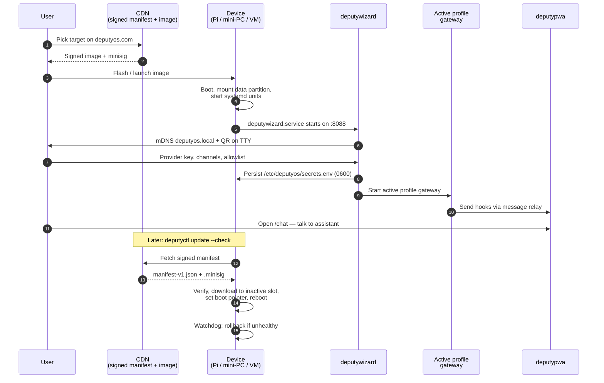
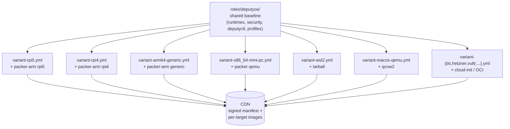
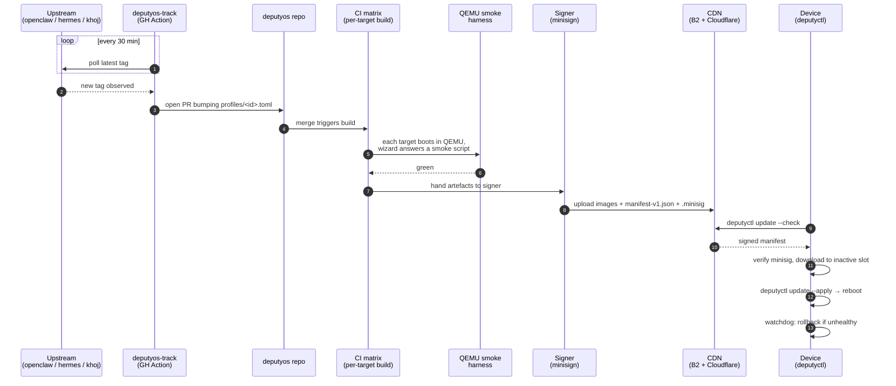

# Architecture

deputyOS is an *appliance image* for personal AI assistants. This page
explains what that phrase means in practice, what runs on a booted device,
how a device gets from "freshly flashed" to "operational", and how it is
updated over time. The goal is a working mental model of the system — not
a tour of source files. For source-grounded detail, follow the cross-links
into [Reference](../reference/cli/deputyctl.md).

## The appliance model

A traditional install puts a Linux distribution on a device and then layers
an application on top. The application brings its own runtime
(`apt install nodejs`, `pip install …`, `npm install …`), pulls native
modules at install time, writes service units, and hopes the host's package
manager and the application's package manager agree about everything in
between. Every step talks to the network. Every step can fail.

deputyOS inverts that. The image is built once, in a controlled environment,
with every runtime, every native module, every signature database, every
configuration template baked in. The booted device runs a Linux kernel and
systemd, but it does not run a package manager *for the assistant*. The
assistant — and the deputyOS management surface — are already on disk.

The single load-bearing invariant is therefore:

!!! warning "Zero first-boot network installs"
    No `apt`, `npm`, `pip`, `cargo`, or `git clone` runs after the image is
    flashed. The only outbound network traffic on first boot is DHCP, DNS,
    NTP, and the model provider the user chose. Optional additions
    (Tailscale, Cloudflare Tunnel) are user-driven and explicitly opt-in.

Everything else in this document is a consequence of that invariant.

## Lifecycle from a user's perspective



The phases are:

1. **Pick.** The user visits the picker page, which reads the latest signed
   manifest and surfaces the right artefact for their hardware. See
   [Reference → Schemas → release manifest](../reference/schemas/release-manifest.md).
2. **Flash / launch.** For real hardware, an image is written to an SD card
   or NVMe. For a desktop, the [`deputyos-desktop`](../reference/cli/deputyos-desktop.md)
   launcher boots the image inside the platform's native hypervisor (WSL2,
   UTM, qemu+KVM). For a cloud VM, a 1-Click marketplace listing or a
   `cloud-init` recipe applies.
3. **Boot.** The kernel comes up with sysctls already tuned, AppArmor
   already enforcing, ufw already default-deny. systemd starts the wizard,
   the QR-on-TTY service, mDNS via Avahi, and (if a profile is already
   selected) the active profile's gateway service.
4. **Wizard.** The user opens `http://deputyos.local` (mDNS) or scans the
   QR shown on the HDMI output. [`deputywizard`](../reference/cli/deputywizard.md)
   collects the model provider key, the chosen channels, and the gateway
   allowlist; it validates the key against the provider with a real
   round-trip; it writes `/etc/deputyos/secrets.env` at mode 0600 and
   restarts the gateway.
5. **Run.** [`deputypwa`](../reference/cli/deputypwa.md) is the always-on
   dashboard at `deputyos.local/chat`. The active profile's gateway speaks
   to it through the [message relay](../reference/apis/message-relay.md).
   Day-to-day operations happen via the PWA or via [`deputyctl`](../reference/cli/deputyctl.md).
6. **Update.** When upstream cuts a new release, the
   [`deputyos-track`](../reference/cli/deputyos-track.md) bot proposes a
   manifest bump; CI bakes new images; the signed manifest is published
   to the CDN. `deputyctl update --check` polls; `deputyctl update --apply`
   writes the new image into the inactive A/B slot, sets a one-shot boot
   pointer, and reboots.
7. **Rollback.** If the new slot fails to come up healthy within five
   minutes, the watchdog rolls back to the previous slot. The data
   partition is never overwritten — user state survives both the update
   and the rollback. See [Operations → Update and rollback](../operations/update-and-rollback.md).

## The image as the unit of release

The image is the unit of trust, the unit of distribution, and the unit of
rollback. Every image carries:

- **Two read-only system slots** (`slotA`, `slotB`). One is active; the
  other is the rollback target.
- **A read-write data partition** mounted at `/home/agent/` (and
  `/var/log/deputyos/`, `/etc/deputyos/secrets.env`, the cost ledger).
  Persists across image swaps.
- **A FAT firmware partition** carrying the bootloader configuration and
  any pre-flash user config (`deputyos.yaml` on Pi).
- **A baked-in SBOM** at `/etc/deputyos/sbom.json` (CycloneDX) and a
  build-provenance file at `/etc/deputyos/build.json` (commit, builder,
  profile versions, ClamAV DB date, Magika model version).
- **The active profile's bake** under `/opt/deputyos/profiles/<id>/`.
- **Pre-resolved offline caches** for npm, pip/uv, and skill assets under
  `/var/cache/deputyos/`.
- **Packed ClamAV signatures** at `/var/lib/clamav/` and
  [Magika](https://google.github.io/magika/) model weights at
  `/opt/deputyos/magika/`.

The full filesystem inventory is in
[Reference → System → Filesystem layout](../reference/system/filesystem-layout.md).

!!! note "A/B is hardware-dependent"
    Not every target supports A/B. Pi, mini-PC, and qcow2 images do.
    DigitalOcean uses platform snapshots; Hetzner / Vultr / Linode /
    Fly.io use re-deploy with the new manifest. WSL2 is a tarball
    re-import. Each strategy is documented in
    [Distribution → Hardware matrix](../distribution/hardware-matrix.md)
    and [Operations → Update and rollback](../operations/update-and-rollback.md).

## Process model on a running device

Five long-running processes (six if you count the message relay's
helper) make up the runtime surface:

```mermaid
flowchart LR
    subgraph systemd["systemd (AppArmor enforced, ufw default-deny)"]
        wizard["deputywizard.service<br/>:8088 (mDNS deputyos.local)"]
        pwa["deputypwa.service<br/>:8088 /chat (post-wizard)"]
        gateway["&lt;profile&gt;-gateway.service<br/>OpenClaw / Hermes / Khoj"]
        relay["agent-relay.service<br/>Unix socket"]
        qr["deputyos-qr-on-tty.service<br/>HDMI / serial"]
        avahi["avahi-daemon<br/>mDNS"]
    end
    user[/User on LAN/]
    pwa <--> user
    wizard <--> user
    gateway -- hooks --> relay
    relay --> pwa
    relay --> gateway
    qr -. prints URL on boot .- user
    avahi -. deputyos.local .- user
```

What each one does:

- **[`deputyctl`](../reference/cli/deputyctl.md)** is not a daemon. It is the
  operator CLI — invoked over SSH or by the wizard, the PWA, or systemd
  one-shots. It reads the active profile's manifest (see
  [Reference → Schemas → profile.toml](../reference/schemas/profile-toml.md)),
  drives systemd, validates model keys, performs updates, rotates secrets,
  runs backups, and prints capability limits.
- **[`deputywizard`](../reference/cli/deputywizard.md)** is a small axum HTTP
  server on `:8088` that implements the first-boot UX. It is profile-aware
  (it asks the questions each profile's manifest declares it needs) but
  profile-agnostic in code. It writes `/etc/deputyos/secrets.env` and hands
  off to the gateway. Routes are documented in
  [Reference → APIs → wizard HTTP](../reference/apis/wizard-http.md).
- **[`deputypwa`](../reference/cli/deputypwa.md)** is the always-on dashboard
  + private chat client. It replaces the wizard on `:8088` once first-boot
  setup completes. Routes are documented in
  [Reference → APIs → PWA HTTP](../reference/apis/pwa-http.md). It surfaces
  the [`deputyctl limits`](../reference/cli/deputyctl.md) view, the cost
  ledger (see [Operations → Cost guardrails](../operations/cost-guardrails.md)),
  the channel toggles, and the chat UI.
- **The active profile's gateway** is the upstream agent itself —
  `openclaw onboard --daemon`, `hermes gateway start`, or
  `khoj --no-gui --host 127.0.0.1 --port 42110` — running under its own
  systemd unit and its own AppArmor profile. deputyOS adds nothing inside
  the agent process; it provides the host environment, the secrets, the
  channel allowlist, and the relay.
- **The message relay** is a tiny Unix-socket service that brokers
  hook events between the gateway and the rest of deputyOS (the PWA, the
  cost ledger, the doctor). Its wire format is in
  [Reference → APIs → message relay](../reference/apis/message-relay.md);
  its hook payload schemas are in
  [Reference → Schemas → hook payloads](../reference/schemas/hook-payloads.md).
  Hooks are how a profile signals "channel inbound", "tool call started",
  "cost incurred", etc., without each profile having to learn deputyOS-specific
  IPC.
- **The QR-on-TTY service** prints the wizard URL and a QR code to the
  HDMI output and the serial console at boot, so a headless device is
  reachable without SSH.
- **Avahi** advertises `deputyos.local` on mDNS for trivial LAN discovery.

All long-running services run under systemd with AppArmor in enforce mode,
ufw default-deny on the inbound chain, and a non-root `agent` user owning
the data partition. See [Reference → System → systemd units](../reference/system/systemd-units.md)
and [Reference → System → AppArmor profiles](../reference/system/apparmor-profiles.md)
for the per-unit and per-profile details.

## How profiles plug in

A profile is data, not code. It contributes:

- A TOML manifest at `profiles/<id>.toml` (schema in
  [Reference → Schemas → profile.toml](../reference/schemas/profile-toml.md)).
- An Ansible bake recipe under `roles/deputyos/tasks/profile-<id>.yml`
  that populates `/opt/deputyos/profiles/<id>/` *at build time*.
- A systemd unit template, an AppArmor profile, and an offline-bake
  fallback stub.

deputyOS itself — `deputyctl`, the wizard, the PWA, the tracker, the
desktop launcher — is profile-agnostic. The third profile (Khoj)
landed without a single Rust change; the cargo test count stayed at
221. See [Concepts → Plugin model](plugin-model.md) for the full
contract and [How-to → Add a profile](../how-to/add-a-profile.md) for
the recipe.

The rule for what counts as a profile is in
[Concepts → Profile class](profile-class.md).

## The shared role and variant gates

The Ansible role at `roles/deputyos/` is the single source of truth for
what goes into an image. Each Packer template (one per hardware target)
just picks a builder; the provisioning is the same role with a
*variant gate* that selects target-specific tasks.



The variant gate is `when: hw == "<target>"` on each target-specific task
file. A task that is not target-aware lives in the shared baseline. The
build pipeline is documented in
[Build → Image bake internals](../build/image-bake-internals.md); adding
a new target is a five-file change documented in
[How-to → Add a hardware target](../how-to/add-a-hardware-target.md).

!!! tip "One role, many images"
    The same Ansible role that runs in CI runs on a contributor's laptop
    via `make build TARGET=<hw>`. macOS, Windows-WSL2, and Linux are all
    first-class build hosts. There is no privileged build environment.

## The release loop



The signing key is offline; the minisign public key is baked into every
image. Signature verification is non-skippable on the update path. The
trust chain is described in detail in
[Security → Update trust chain](../security/update-trust-chain.md). The
wire format of the manifest is in
[Reference → Schemas → release manifest](../reference/schemas/release-manifest.md).

## What's deliberately *not* in this picture

- **Containers on the device.** deputyOS uses systemd, AppArmor, and the
  `agent` user — not Docker — to confine the gateway. Containers add
  indirection (data-volume bugs, networking complexity, image-pull at boot)
  that conflict with the zero-first-boot-network-installs invariant.
- **Package upgrades on the device.** deputyOS never `apt upgrade`s itself.
  Upgrades are full image swaps. See
  [Operations → Update and rollback](../operations/update-and-rollback.md).
- **Delta updates.** A new image is 1.5–4 GB; we accept that for the
  invariant. Bandwidth-conscious users can pin to LTS image revs.
- **OAuth flows in the wizard.** Every supported model provider takes an
  API key. OAuth on a headless device is hostile; the wizard collects a
  key and validates it with a real round-trip. The exception is
  storage-bucket provisioning (Cloudflare R2), which is a storage flow,
  not a model-access flow.
- **Multi-tenant isolation.** A device runs one active profile at a time
  for one user. deputyOS is not a hosting platform.

## Where to go next

- [Concepts → Profile class](profile-class.md) — the rule for what is and
  is not a profile.
- [Concepts → Plugin model](plugin-model.md) — how a third profile lands
  with zero Rust changes.
- [Concepts → Threat model overview](threat-model-overview.md) — the
  adversaries, the trust boundaries, and the layered defenses, with
  forward links into [Security](../security/default-on-controls.md).
- [Reference → CLI → deputyctl](../reference/cli/deputyctl.md) — the
  authoritative inventory of operator commands.
- [Reference → APIs → message relay](../reference/apis/message-relay.md) —
  the IPC protocol that wires the gateway to the rest of the appliance.
- [Build → Image bake internals](../build/image-bake-internals.md) — what
  actually happens when CI (or your laptop) builds an image.
