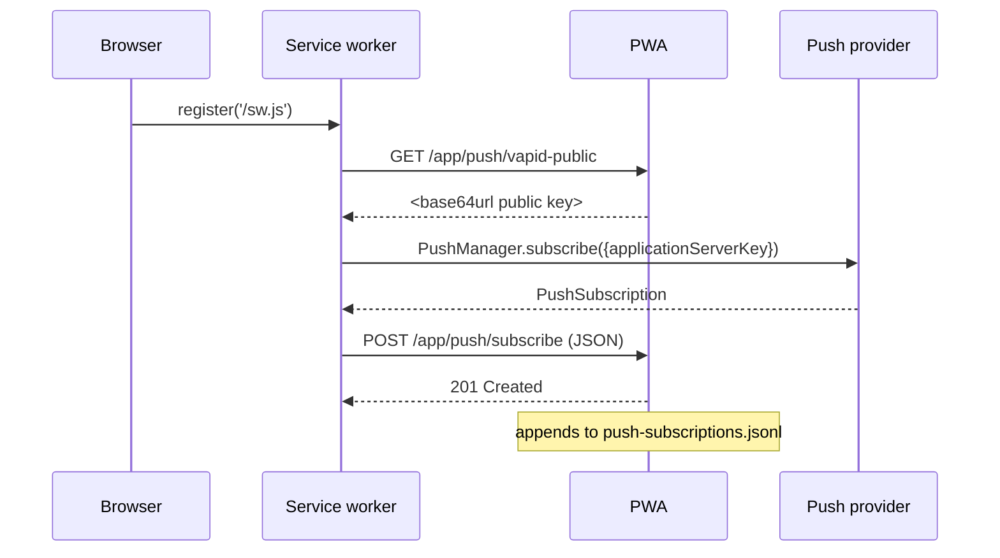

# deputypwa HTTP API

The deputyOS PWA is a small [axum](https://docs.rs/axum) web app that
provides a LAN-trusted dashboard, log viewer, key rotation surface,
and Web Push subscription endpoint. Routes are registered in
[`deputypwa/src/routes.rs`](https://github.com/deputyos/deputyos/blob/main/deputypwa/src/routes.rs).

The PWA shells out to `deputyctl <subcmd> --json` for everything it
displays. There is no server-side state beyond the VAPID keypair and
the in-memory single-shot flash slot.

[TOC]

## Trust model

M3-PWA is **LAN-trusted**. Same trust model the wizard hands off when
it finishes — operators on the LAN are assumed allowed. Production
bakes can layer Tailscale or Cloudflare Tunnel for stronger auth
without changing this code.

There is no token or session check on the PWA's protected routes
today. (The wizard's auth flow is independent; see [wizard
HTTP](wizard-http.md#authentication).)

## Public routes

| Method | Path | Response |
|---|---|---|
| GET | `/` | `302 Location: /app/dashboard` |
| GET | `/healthz` | `200 ok` (text/plain) |
| GET | `/manifest.webmanifest` | The PWA's web app manifest (`application/manifest+json`). |
| GET | `/sw.js` | The service worker (`text/javascript`). |
| GET | `/static/style.css` | Bundled CSS. |
| GET | `/static/icon.svg` | Bundled icon. |

## Application routes

All return HTML rendered by the bundled templates module.

| Method | Path | Renders | Underlying `deputyctl` calls |
|---|---|---|---|
| GET | `/app/dashboard` | Dashboard view | `deputyctl status --json`, `version --json`, `limits --json`, `cost --json`, `doctor --json` |
| GET | `/app/logs?lines=<n>` | Journal tail viewer | `deputyctl status --json` then `journalctl -u <unit> -n <lines>` |
| GET | `/app/keys` | Provider key list | `deputyctl model list --json` |
| POST | `/app/keys/rotate` | Flash → 302 to `/app/keys` | `deputyctl model set --provider <p> --key-from-stdin --yes` |
| GET | `/app/mounts` | Mounts + shares table with per-row revoke | `deputyctl::mounts::list` (in-process; via `data::fetch_mounts`) |
| POST | `/app/mounts/remove` | Flash → 303 to `/app/mounts` | `deputyctl::mounts::remove_by_id` (in-process) |
| GET | `/app/network` | Egress policy + mounts table | `deputyctl network status --json` + `deputyctl::mounts::list` |
| GET | `/app/tunnel` | Integrated tunnel state + copy-able public URL | `data::fetch_tunnel` (systemctl + token-file presence; booleans only) |
| GET | `/app/account` | Device identity + token presence | `data::fetch_account` (reads `/etc/deputyos/account.json`; booleans only) |
| POST | `/app/cost/raise-cap` | Flash → 302 to `/app/dashboard` | `deputyctl cost raise-cap` |
| POST | `/app/reset-cost-trip` | Flash → 302 to `/app/dashboard` | `deputyctl cost reset-trip` |
| POST | `/app/push/subscribe` | `201 Created` (text) | – (writes to subscriptions file) |
| GET | `/app/push/vapid-public` | VAPID public key, base64url encoded | – |

## Per-route detail

### `GET /app/dashboard`

Calls `data::fetch_dashboard` on a blocking thread. The function
shells out to the five `deputyctl ... --json` subcommands and
deserialises each into a typed view; failures fill the corresponding
slice with defaults and set `stub=true` (so the UI shows "stub" badges
rather than crashing).

In dev-stub mode (`DEPUTYPWA_DEV_STUB=1`) or when `deputyctl` is not on
PATH, the function returns a synthetic dashboard so the UI is
exercisable without an image.

Response shape: HTML — the dashboard template renders status, version,
limits summary, cost summary, and doctor verdict.

### `GET /app/logs?lines=<n>`

Query: `lines` (optional, defaults to 100; clamped to 10..1000).

Calls `data::fetch_dashboard` for the active unit name, then
`data::fetch_journal_tail(unit, lines)` which shells out to
`journalctl -u <unit> -n <lines>` on a blocking thread.

Falls back to `openclaw.service` if the active profile is unknown.

Response: HTML — the logs template renders the journal output as
preformatted text.

### `GET /app/keys`

Calls `data::fetch_providers` (which shells `deputyctl model list
--json`). Renders the provider list, each row with a "Rotate" form
that POSTs to `/app/keys/rotate`. The page also surfaces a single-shot
`flash` message stored in memory.

In dev-stub mode, returns a synthetic catalogue.

### `POST /app/keys/rotate`

Form body:

```
provider=<id>&api_key=<value>
```

Validation: both fields non-empty.

Action: spawns `deputyctl model set --provider <id> --key-from-stdin
--yes` on a blocking thread, pipes `api_key` to stdin. On success
flashes "Rotated <id> successfully."; on failure flashes the
captured stderr.

In dev-stub mode, no subprocess is run — flashes
`(dev-stub) would rotate <id> via …`.

Response: `302 Location: /app/keys` so the flash renders on next
render of the keys page.

### `POST /app/push/subscribe`

Body: `application/json`. The full Web Push subscription object as
emitted by `PushManager.subscribe()`:

```json
{
  "endpoint": "https://fcm.googleapis.com/fcm/send/...",
  "expirationTime": null,
  "keys": {
    "p256dh": "BNcRdr...base64url...",
    "auth":   "BTBZi...base64url..."
  }
}
```

Action: appends one JSON line to `<data_dir>/push-subscriptions.jsonl`
(default `/var/lib/deputyos/push-subscriptions.jsonl`; tests pin via
`AppState::with_subscriptions_path`). Mode 0640.

Response: `201 Created` with body `ok` on success;
`500 Internal Server Error` with an HTML error page on failure.

### `GET /app/push/vapid-public`

Returns the **VAPID public key** as base64url-encoded text/plain. Used
by the service worker / front-end to pass to `PushManager.subscribe()`.

If push is disabled (openssl wasn't available at boot, or the keypair
hasn't been generated), returns the empty string with `text/plain`.

The VAPID keypair is generated lazily on first PWA startup at
`<data_dir>/vapid.pem` (mode 0600). Generation shells out to `openssl
ecparam -genkey -name prime256v1`. See
[`deputypwa/src/push.rs`](https://github.com/deputyos/deputyos/blob/main/deputypwa/src/push.rs).

### `GET /app/mounts`

Calls `data::fetch_mounts` on a blocking thread, which (in production)
reads the live policy in-process via `deputyctl::mounts::list(None)` and
(in dev-stub mode, or when `deputyctl` is not on PATH) returns a
deterministic two-entry fixture so the page is exercisable without an
image. Renders the configured mounts + shares as a table with a per-row
"Revoke" form posting to `/app/mounts/remove`, plus any single-shot
flash. See [mounts-policy schema](../schemas/mounts-policy.md).

A5: the PWA only ever shows mount *metadata* (id, kind, guest path, mode,
source). Credentials are never read or rendered.

### `POST /app/mounts/remove`

Form body: `id=<mount-id>`. Calls `deputyctl::mounts::remove_by_id` on a
blocking thread (in-process; rewrites `mounts-policy.json`). Flashes
`Revoked mount "<id>".` on success or the captured error on failure.
Response: `303 See Other Location: /app/mounts` so the flash renders on
the next GET. (Boot re-materialisation is a separate `deputyctl mounts
apply` step; the PWA only edits the policy file.)

### `GET /app/network`

Renders the egress policy (`deputyctl network status --json`) and the
same mounts table as `/app/mounts` (read-only here — revoke lives on the
mounts page).

### `GET /app/tunnel` · `GET /app/account` (M8)

`/app/tunnel` renders `data::fetch_tunnel` — integrated tunnel state
(`systemctl is-active/is-enabled deputyos-tunnel`, tunnel-token file
*presence*) and a copy-able relay URL. `/app/account` renders
`data::fetch_account` — the non-secret `/etc/deputyos/account.json` label
(registered flag, email, device id/name) plus tunnel/backup token
*presence*. A5: both pages show booleans/presence only — never token
contents.

### `POST /app/cost/raise-cap` · `POST /app/reset-cost-trip`

Form-driven cost-guardrail actions. `raise-cap` shells to
`deputyctl cost raise-cap`; `reset-cost-trip` shells to
`deputyctl cost reset-trip`. Both flash a result message and redirect to
`/app/dashboard`.

## Web Push subscription flow



The PWA itself doesn't send notifications today — `cost-alert` and
`update-applied` hooks are the future emitters. The subscription file
is the durable record they'll consume.

## Dev-stub mode

When `DEPUTYPWA_DEV_STUB=1` is set (or when `deputyctl` is not on PATH):

- `/app/dashboard` renders a synthetic dashboard with a "stub" badge.
- `/app/keys` renders a synthetic provider list.
- `/app/keys/rotate` flashes `(dev-stub) would rotate ...` instead of
  shelling out.
- `/app/mounts` renders a two-entry stub fixture (host-fs + cifs) via
  `data::stub_mounts`.
- `/app/tunnel` and `/app/account` render stub cards via
  `data::stub_tunnel` / `data::stub_account`.
- `/app/logs` may show "(journal task failed)" if `journalctl` isn't
  on PATH.

This makes `make pwa` exercisable on a developer laptop without a
baked deputyOS image.

## Side-effect map

| Operation | Files written | Subprocesses spawned |
|---|---|---|
| GET `/app/dashboard` | – | 5× `deputyctl ... --json` |
| GET `/app/logs` | – | 1× `deputyctl status --json` + 1× `journalctl` |
| GET `/app/keys` | – | 1× `deputyctl model list --json` |
| POST `/app/keys/rotate` | `/etc/deputyos/secrets.env` (via deputyctl) | 1× `deputyctl model set` |
| GET `/app/mounts` | – | – (in-process `deputyctl::mounts::list`) |
| POST `/app/mounts/remove` | `/etc/deputyos/mounts-policy.json` (rewrite) | – (in-process `remove_by_id`) |
| GET `/app/network` | – | 1× `deputyctl network status --json` |
| GET `/app/tunnel` | – | 2× `systemctl is-active/is-enabled` |
| GET `/app/account` | – | – (reads `/etc/deputyos/account.json`) |
| POST `/app/cost/raise-cap` | – (via deputyctl) | 1× `deputyctl cost raise-cap` |
| POST `/app/reset-cost-trip` | `/var/lib/deputyos/cost-tripped` (via deputyctl) | 1× `deputyctl cost reset-trip` |
| POST `/app/push/subscribe` | `<data_dir>/push-subscriptions.jsonl` (append) | – |
| GET `/app/push/vapid-public` | (lazy) `<data_dir>/vapid.pem` (first call only) | (lazy) `openssl ecparam` (first call only) |

## See also

- [Reference / CLI / deputypwa](../cli/deputypwa.md) — the `serve`
  subcommand, env vars, dev-stub mode.
- [Reference / CLI / deputyctl](../cli/deputyctl.md) — the
  `--json`-emitting subcommands the PWA shells.
- [Reference / Schemas / Providers](../schemas/providers-json.md) —
  what `/app/keys` lists.
- [Reference / System / Filesystem layout](../system/filesystem-layout.md) —
  `vapid.pem`, `push-subscriptions.jsonl` paths.
- [How-to / Rotate keys](../../how-to/rotate-keys.md) — the user
  workflow that goes through `/app/keys/rotate`.
- [Operations / Monitoring and logs](../../operations/monitoring-and-logs.md) —
  what `/app/logs` is showing.
